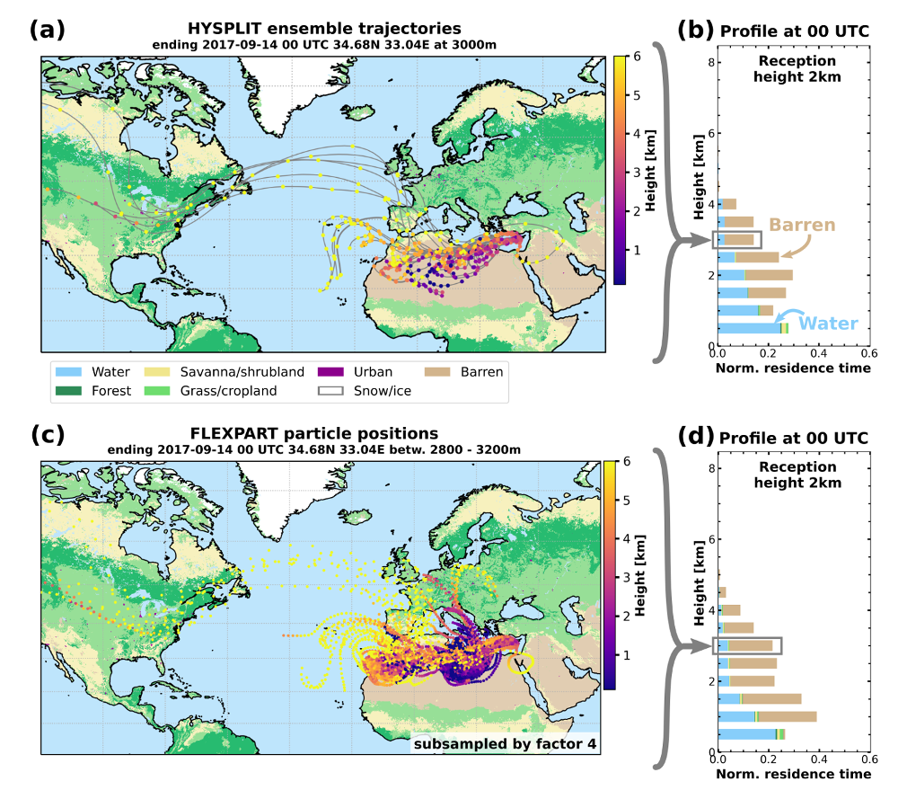
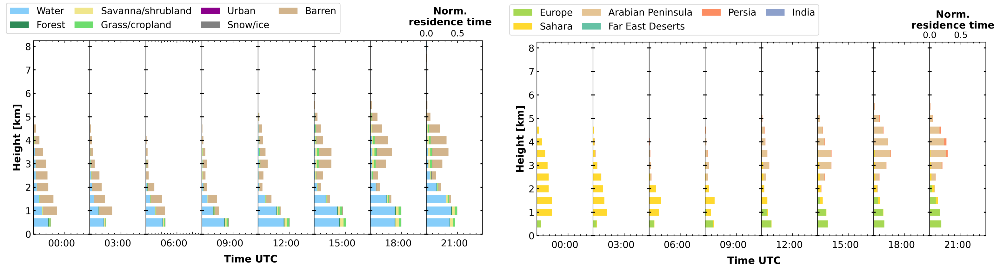
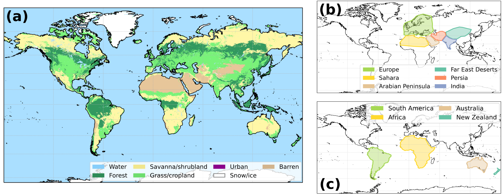

## trace_airmass_source: trajectory analysis tool

[](https://doi.org/10.5281/zenodo.2576558)

Airmass transport simulations are combined with a land cover classification for a temporally and vertically resolved airmass source attribution. 
The air parcel locations can be taken form HYSPLIT ensemble trajectories (Stein et al., 2015) or particle positions from FLEXPART (PISSO et al., 2019). 

Whenever a airparcel is below a defined reception height, the land cover is categorized using custom defined polygons encompassing areas of interest or a simplified version (number of categories reduced to 7) of the MODIS land cover classification (Friedl et al., 2002, Broxton et al., 2014). 
An airparcel is assumed to be influenced by the land surface if the trajectory is below the reception. The residence time for each category is then the total time an airparcel fulfilled this criterion by land cover category. This calculation is repeated in steps of 3h in time and 500m in height to provide a continuous estimate on the airmass source and as a first hint on potential aerosol load.
From the results a time-height plot of airmass source can be generated for a certain location, which is comparable to active remote sensing time-height plots.

Comprehensive documentation is available at [trace-doc](https://martin-rdz.github.io/trace-doc/) and in [ACP Discussion paper](https://acp.copernicus.org/preprints/acp-2020-955/)

### Examples




### Installation
trace_airmass_source is written in python3 and requires an extensive of additional packages. There are two options to acquire these packages.

#### local python installataion
Install all the packages listed in [requirements.txt](requirements.txt)

#### docker container
Deployment may be simplified using a docker image which includes all the dependencies.
This docker container also includes Flexpart 10.4.

```
# build the Dockerfile
docker build -t trace_env .
# run an interactive bash on this image
docker run -v `pwd`:/trace -it trace_env /bin/bash
# or to build the documentation as well
docker run -v `pwd`/..:/trace -it trace_env /bin/bash
# or to just run a command
docker exec -i CONTAINERNAME bash -c "cd trace && ..."
```

When using docker under windows, the `pwd` has to be replaced by the path to the local trace directory.


### Quick-Setup

Please put your credentials (name, institution, contact) in the `output_meta.toml` file.

If FLEXPART shall be used with GFS grib data, the login credential for the GFS data from `rda.ucar.edu` has to be stored in `server_logins.toml`.


    [flexpart]
        login = ''
        password = ''


Each station requires a config file. An example for Limassol is provided `config_limassol.toml`.
A subfolder named after the respective station should exisit the folders `trajectories`, `flexpart_partposit` and `output`.
    

### Usage
Running trace consists of several steps, that are (partly) automated in the `autorun.sh` script.

#### Preparing the transport simulations
As input for an airmass source estimate, either HYSPLIT backward trajectories **or** FLEXPART particle positions are required.
Simulations with FLEXPART can be done within the docker container. The HYSPLIT backward trajectories have to be calculated separately.


##### HYSPLIT
HYSPLIT backward trajectories are required, a 10-day 27-member ensemble setup is recommended. Please note that HYSPLIT itself is not provided within this package (The binary to run is `hyts_ens` with the respective `CONTROL` file).
Meteorological input data for HYSPLIT are taken from the GDAS1 dataset (<https://www.ready.noaa.gov/gdas1.php>) provided by the Air Resources Laboratory (ARL) of the U.S. National Weather Service’s National Centers for Environmental Prediction (NCEP).
An trajectory is calculated every 3h in steps of 500m. Conveniently the input trajectories are placed in the `trajectories` directory.

A list of required trajectories can be generated with:

```
python3 gen_hysplit_input.py --station STATIONNAME
```

The filename of each trajectory should be

```
hysplit_trajectory-[YYYYMMDD-HH]-[lat]-[lon]-[height]-[length].tdump
```

See the documenation for more information on configuring the HYSPLIT simulations.
After the HYSPLIT output is on hand, it can be checked if all required files are available:

```
python3 test_data_avail.py --station [stationname] --daterange [YYYYMMDD_begin-YYYYMMDD_end]
```

##### FLEXPART
Download the GFS grib files (using the credentials defined in `server_logins.toml`)

```
python3 download_gfs.py --daterange YYYYMMDD-YYYYMMDD
```

Start the FLEXPART run

```
python3 run_flexpart_trace.py --station STATIONNAME --date YYYYMMDD
```

Optionally, plot and animate the particle positions

```
python3 animate_flex.py --station STATIONNAME --datetime YYYYMMDD-HH --levels I,J --dynamics true|false    
```

#### Running the airmass source estimate
    
The actual processing is started with:

```
python3 run_assemble.py --model FLEX¦HYSPLIT --station STATIONNAME --daterange YYYYMMDD-YYYYMMDD
```

From the netcdf files in the `output` directory the plots are generated by:

```
python3 plot2d.py --model FLEX|HYSPLIT  --station STATIONNAME --daterange YYYYMMDD-YYYYMMDD
```

Afterwards the files with the raw trajectires (currently only HYSPLIT) can be compressed to day-wise zip files:

```
python3 compress_data.py --station STATIONNAME --daterange YYYYMMDD-YYYYMMDD
```

### Surface classification
Currently two sources for the surface classification are available. The raster-based MODIS land cover classification and the polygon-based geography names.




#### MODIS land cover
The MODIS land cover classification (Friedl et al., 2002, Broxton et al., 2014) with its 17 categories and 0.5km resolution is simplified to 7 categories (barren, snow, urban, grass, savanna/shrublands, forrest, water) and regridded to a 0.1º (~11km).

#### "named geography"
The extend and the name of a geography feature - usually a (sub-)continent - is defend within a `.kml` file. Examples for are available in the `data` directory for Europe and the shorelines of the Atlantic Ocean.


### config files

Trace can by adjusted by two types of config files. One for the site or campaign named `config_[site_name].toml`. Examples are given for the site of Limassol and the Polarstern cruise PS113.
The second one - `geonames_config.toml` - is used to wire togehter the named geographies. 


### Used in
- Haarig, M., Ansmann, A., Gasteiger, J., Kandler, K., Althausen, D., Baars, H., Radenz, M., and Farrell, D. A.: Dry versus wet marine particle optical properties: RH dependence of depolarization ratio, backscatter, and extinction from multiwavelength lidar measurements during SALTRACE, Atmos. Chem. Phys., 17, 14199-14217, <https://doi.org/10.5194/acp-17-14199-2017>, 2017. 
- Foth, A., Kanitz, T., Engelmann, R., Baars, H., Radenz, M., Seifert, P., Barja, B., Fromm, M., Kalesse, H., and Ansmann, A.: Vertical aerosol distribution in the southern hemispheric midlatitudes as observed with lidar in Punta Arenas, Chile (53.2° S and 70.9° W), during ALPACA, Atmos. Chem. Phys., 19, 6217–6233, <https://doi.org/10.5194/acp-19-6217-2019>, 2019. 


### References
- Stein, A.F., R.R. Draxler, G.D. Rolph, B.J. Stunder, M.D. Cohen, and F. Ngan: NOAA’s HYSPLIT Atmospheric Transport and Dispersion Modeling System. Bull. Amer. Meteor. Soc., 96, 2059–2077, <https://doi.org/10.1175/BAMS-D-14-00110.1>, 2015
- Friedl, M. A., McIver, D. K., Hodges, J. C., Zhang, X. Y., Muchoney, D., Strahler, A. H., Woodcock, C.E., Gopal, S., Schneider, A., Cooper, A., Baccini, A., Gao, F., Schaaf, C.: Global land cover mapping from MODIS: algorithms and early results. Remote Sens. Environ., 83(1-2), 287-302, <https://doi.org/10.1016/S0034-4257(02)00078-0>, 2002
- Broxton, P.D., Zeng, X., Sulla-Menashe, D., Troch, P.A.: A Global Land Cover Climatology Using MODIS Data. J. Appl. Meteor. Climatol., 53, 1593-1605. <http://dx.doi.org/10.1175/JAMC-D-13-0270.1>, 2014
- Radenz, M., Seifert, P., Baars, H., Floutsi, A. A., Yin, Z., and Bühl, J.: Automated time-height-resolved airmass source attribution for profiling remote sensing applications, Atmos. Chem. Phys. Discuss. [preprint], <https://doi.org/10.5194/acp-2020-955>, in review, 2020. 


### License
See the LICENSE file for more information
Copyright 2020, Martin Radenz
[MIT License](http://www.opensource.org/licenses/mit-license.php)

<!--
https://landcover.usgs.gov/global_climatology.php 
http://journals.ametsoc.org/doi/abs/10.1175/JAMC-D-13-0270.1-->
