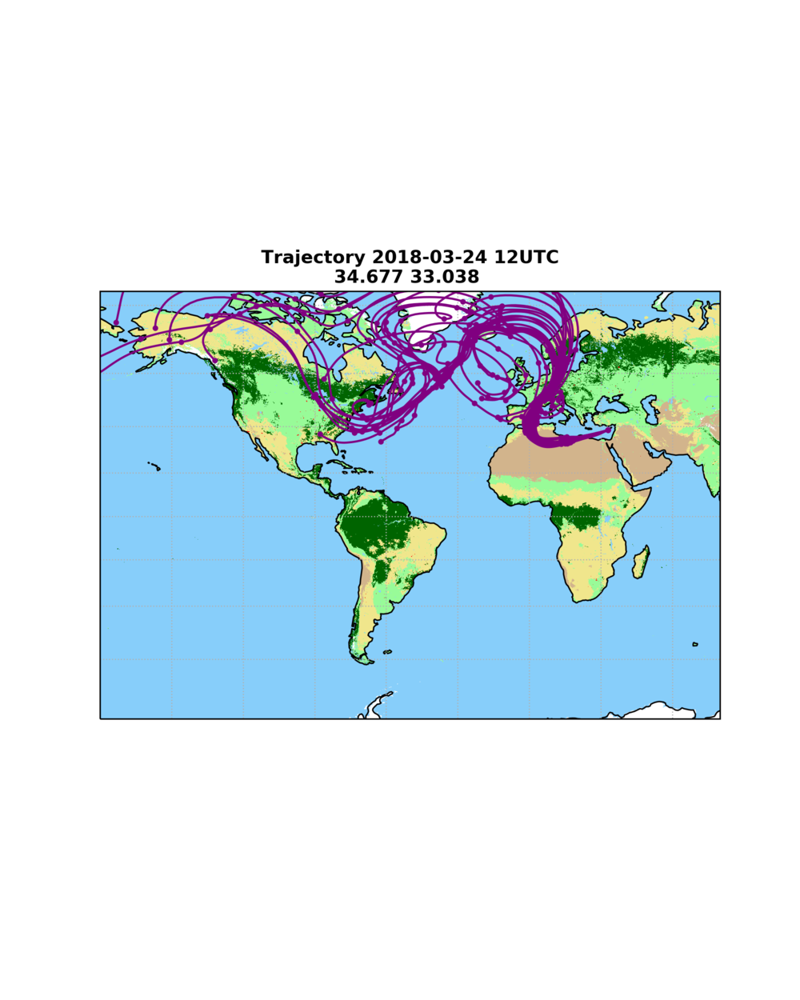
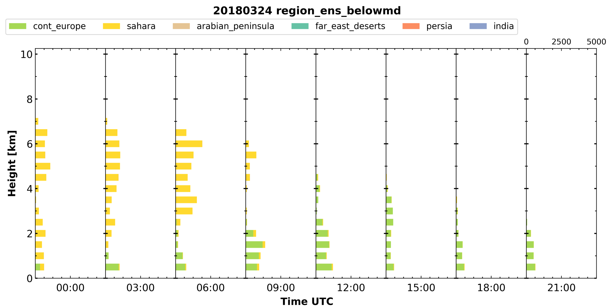
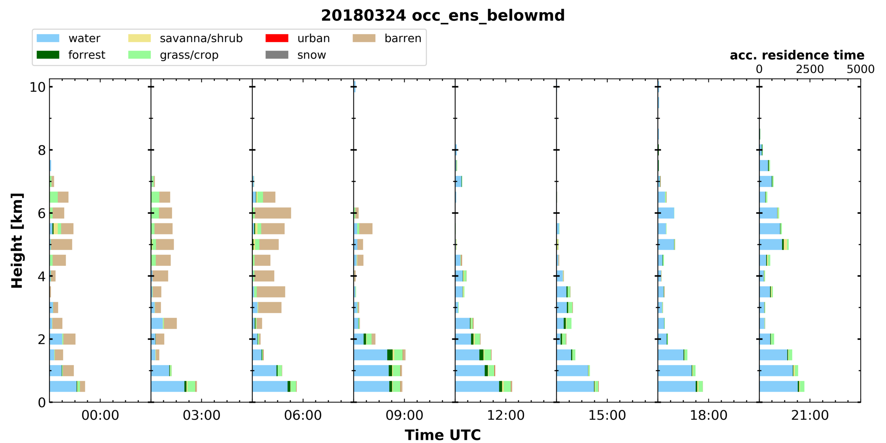
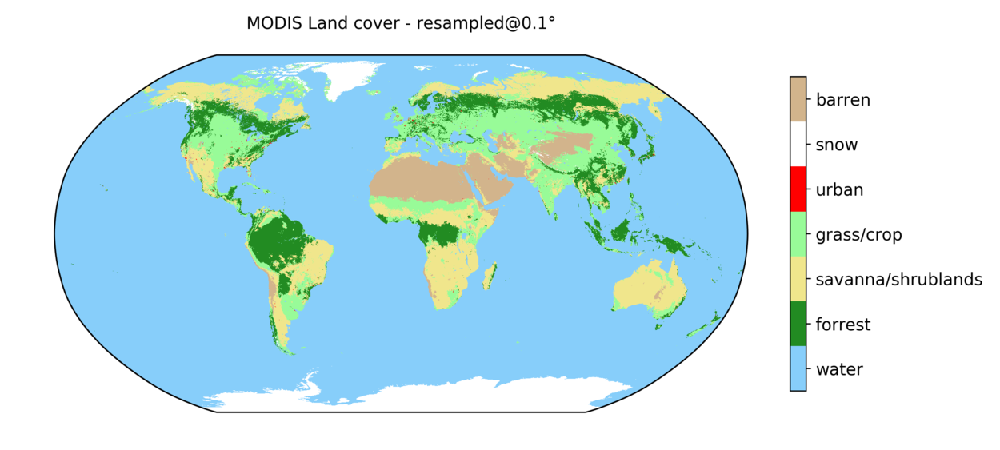

## trace: trajectory analysis tool
[](https://doi.org/10.5281/zenodo.2576558)

Ensemble backward trajectories are combined with a land cover classification for a temporally and vertically resolved airmass source attribution. 
The trajectory information can be delivered by HYSPLIT (Stein et al., 2015) or FLEXPART (PISSO et al., 2019). 
For HYSPLIT a 10-day 27-member ensemble setup is recommended. Each ensemble is generated using a small spatial offset in the trajectory endpoint. Meteorological input data for HYSPLIT are taken from the GDAS1 dataset (<https://www.ready.noaa.gov/gdas1.php>) provided by the Air Resources Laboratory (ARL) of the U.S. National Weather Service’s National Centers for Environmental Prediction (NCEP). 
From FLEXPART a temporally resolved (e.g. every 3h) dump of the particle positions is required. Meteorological input data can be obtained from either UCAR or ECMWF.
Whenever a airparcel is below the mixing depth (“reception height”), the land cover is categorized using custom defined polygons according to land mass boundaries or a simplified version (number of categories reduced to 7) of the MODIS land cover classification (Friedl et al., 2002, Broxton et al., 2014). Hence, an airparcel is assumed to be influenced by the land surface if the trajectory is below the mixing depth. The residence time for each category is then the total time an airparcel fulfilled this criterion by land cover category. This calculation is repeated in steps of 3h in time and 500m in height to provide a continuous estimate on the airmass source and as a first hint on potential aerosol load.
From the results a time-height plot of airmass source can be generated for a certain location, which is comparable to active remote sensing time-height plots.

Comprehensive documentation is available at [trace-doc](https://martin-rdz.github.io/trace-doc/)

### Examples


 


### Setup
trace is written in python3 and requires an extensive of additional packages. There are two options to acquire these packages.

#### local python installataion
Install all the packages listed in [requirements.txt](requirements.txt)

#### docker container
Deployment may be simplified using a docker image which includes all the dependencies.
This docker container also includes Flexpart 10.4.

    # build the Dockerfile
    docker build -t trace_env .
    # run an interactive bash on this image
    docker run -v `pwd`:/trace -it trace_env /bin/bash
    # or to build the documentation as well
    docker run -v `pwd`/..:/trace -it trace_env /bin/bash

Please put your credentials in the `output_meta.toml` file.
The login credential for the gfs data from `rda.ucar.edu` should be stored in `server_logins.toml`

```
[flexpart]
    login = ''
    password = ''
```
    

### Usage
Running trace consists of several steps, that are automated in the `autorun.sh` script.

Generating the a list of trajectories that are required, i.e. an input file for HYSPLIT:

    python3 gen_hysplit_input.py --station [stationname]

After the HYSPLIT output is on hand, it can be checked if all required files are available:

    python3 test_data_avail.py --station [stationname] --daterange [YYYYMMDD_begin-YYYYMMDD_end]
    
The actual processing is started with:

    python3 run_assemble_hysplit.py --station [stationname] --daterange [YYYYMMDD_begin-YYYYMMDD_end]
    
From the netcdf files in the `output` directory the plots are generated by:

    python3 plot2d.py --station [stationname] --daterange [YYYYMMDD_begin-YYYYMMDD_end]
    
Afterwards the files with the raw trajectires can be compressed to day-wise zip files:

    python3 compress_data.py --station [stationname] --daterange [YYYYMMDD_begin-YYYYMMDD_end]


### HYSPLIT input data
HYSPLIT ensemble backward trajectories are required. Please note that HYSPLIT itself is not provided within this package (The binary to run is `hyts_ens` with the respective `CONTROL` file).
In the default setup 10 days with a temporal resolution of 1h. Such an trajectory is calculated every 3h in steps of 500m. Conveniently the input trajectories are placed in the `trajectories` directory.

The filename of each trajectory should be
    hysplit_trajectory-[YYYYMMDD-HH]-[lat]-[lon]-[height]-[length].tdump

SETUP.CFG

    &SETUP
    KMSL=0,
    tm_rain=1,
    tm_tpot=0,
    tm_tamb=1,
    tm_mixd=1,
    tm_relh=1,
    tm_terr=1,
    dxf=0.4,
    dyf=0.4,
    dzf=0.008,
    /

TRAJ.CFG

    &SETUP
    tratio = 0.75,
    delt = 0.0,
    mgmin = 10,
    khmax = 9999,
    kmixd = 0,
    kmsl = 0,
    k10m = 1,
    nstr = 0,
    mhrs = 9999,
    nver = 0,
    tout = 60,
    tm_pres = 1,
    tm_tpot = 0,
    tm_tamb = 1,
    tm_rain = 1,
    tm_mixd = 1,
    tm_relh = 1,
    tm_sphu = 0,
    tm_mixr = 0,
    tm_dswf = 0,
    tm_terr = 1,
    dxf = 0.40,
    dyf = 0.40,
    dzf = 0.01,
    messg = 'MESSAGE',
    /

    
### Surface classification
Currently two sources for the surface classification are available. The raster-based MODIS land cover classification and the polygon-based geography names.

#### MODIS land cover
The MODIS land cover classification (Friedl et al., 2002, Broxton et al., 2014) with its 17 categories and 0.5km resolution is simplified to 7 categories (barren, snow, urban, grass, savanna/shrublands, forrest, water) and regridded to a 0.1º (~11km).



#### "named geography"
The extend and the name of a geography feature - usually a (sub-)continent - is defend within a `.kml` file. Examples for are available in the `data` directory for Europe and the shorelines of the Atlantic Ocean.


### config files

Trace can by adjusted by two types of config files. One for the site or campaign named `config_[site_name].toml`. Examples are given for the site of Limassol and the Polarstern cruise PS113.
The second one - `geonames_config.toml` - is used to wire togehter the named geographies. 


### Used in
- Haarig, M., Ansmann, A., Gasteiger, J., Kandler, K., Althausen, D., Baars, H., Radenz, M., and Farrell, D. A.: Dry versus wet marine particle optical properties: RH dependence of depolarization ratio, backscatter, and extinction from multiwavelength lidar measurements during SALTRACE, Atmos. Chem. Phys., 17, 14199-14217, <https://doi.org/10.5194/acp-17-14199-2017>, 2017. 
- Foth, A., Kanitz, T., Engelmann, R., Baars, H., Radenz, M., Seifert, P., Barja, B., Kalesse, H., and Ansmann, A.: Vertical aerosol distribution in the Southern hemispheric Midlatitudes as observed with lidar at Punta Arenas, Chile (53.2° S and 70.9° W) during ALPACA, Atmos. Chem. Phys. Discuss., <https://doi.org/10.5194/acp-2018-1124>, in review, 2018. 


### References
- Stein, A.F., R.R. Draxler, G.D. Rolph, B.J. Stunder, M.D. Cohen, and F. Ngan: NOAA’s HYSPLIT Atmospheric Transport and Dispersion Modeling System. Bull. Amer. Meteor. Soc., 96, 2059–2077, <https://doi.org/10.1175/BAMS-D-14-00110.1>, 2015
- Friedl, M. A., McIver, D. K., Hodges, J. C., Zhang, X. Y., Muchoney, D., Strahler, A. H., Woodcock, C.E., Gopal, S., Schneider, A., Cooper, A., Baccini, A., Gao, F., Schaaf, C.: Global land cover mapping from MODIS: algorithms and early results. Remote Sens. Environ., 83(1-2), 287-302, <https://doi.org/10.1016/S0034-4257(02)00078-0>, 2002
- Broxton, P.D., Zeng, X., Sulla-Menashe, D., Troch, P.A.: A Global Land Cover Climatology Using MODIS Data. J. Appl. Meteor. Climatol., 53, 1593-1605. <http://dx.doi.org/10.1175/JAMC-D-13-0270.1>, 2014


### License
See the LICENSE file for more information
Copyright 2019, Martin Radenz
[MIT License](http://www.opensource.org/licenses/mit-license.php)

<!--
https://landcover.usgs.gov/global_climatology.php 
http://journals.ametsoc.org/doi/abs/10.1175/JAMC-D-13-0270.1-->
